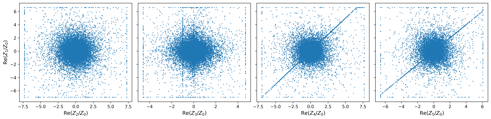
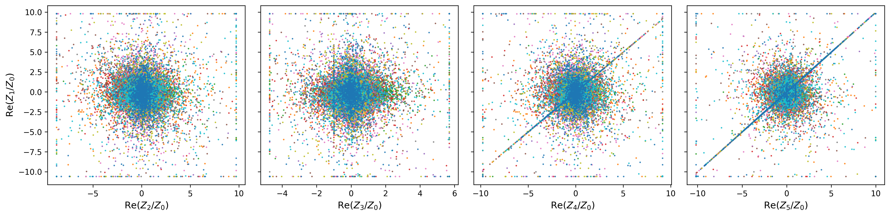

# Improved Point Sampling for CICYs

This repository is a code base that generates points on Complete Intersection Calabi-Yau (CICY) manifolds using the Improved Point Sampling (IPS) method from [Keller and Lukic 2012](https://arxiv.org/abs/0907.1387). This repository is intended to be added to the sampling code that exists for [`cymetric`](https://github.com/ruehlef/cymetric). 

In the image below, you see the current sampling ability of `cymetric` on the Weierstrass cubic. In order to sample points on a CICY, this code base uses the Fubini-Study metric of the complex projective space that the CICY lives in. In the case of the Weierstrass cubic, we can visualize how well the code samples the Weierstrass in uniform Abel-Jacobi coordinates:

  

The sampling method used to create the image above was applied in to calculate the CY metric [in this paper](https://arxiv.org/abs/2205.13408). Although this sampling was used to compute the Ricci-flat CY metric, we aim to sample the CYs more effectively using the IPS method from the Keller and Lukic paper. The sampling ability of the IPS implementation is shown below:

  

Each panel shows 1, 2, 3, 5, 11, and 19 different optimally chosen metrics. Each color of the sampled points represents a different metric found by finding the over- or under-represented sampled patches on the CICY. This algorithm is implemented in `PointGeneratorMathematicaCICYIPS.m`. We also demonstrate the sampling codes effectiveness on the bicubic: 

  

  

Where the first plot shows the sampling code using one metric (the identity), and then the second plot shows the code sampling across 11 different regions. These plots are still in homogeneous coordinates, so the improved ability of the IPS algorithm is not as apparent as in the case of the Weierstrass (in ellipitc coordinates). 