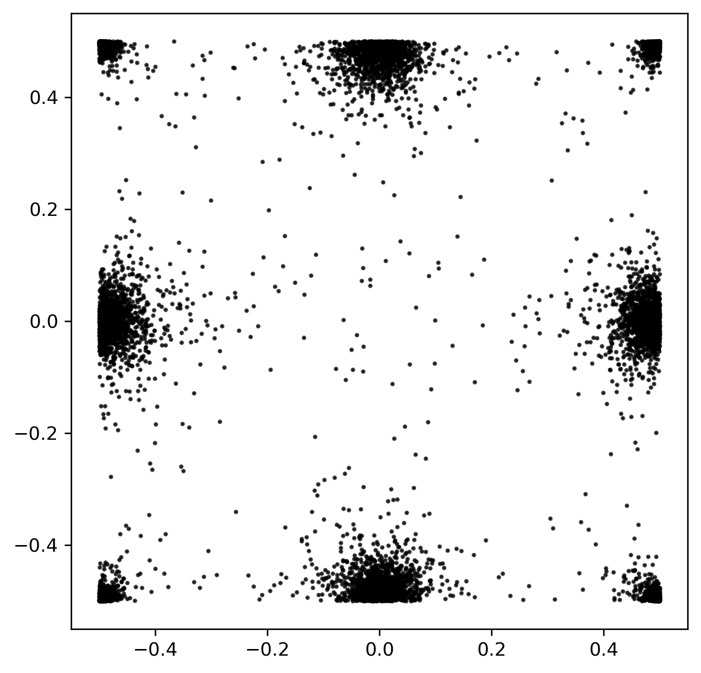
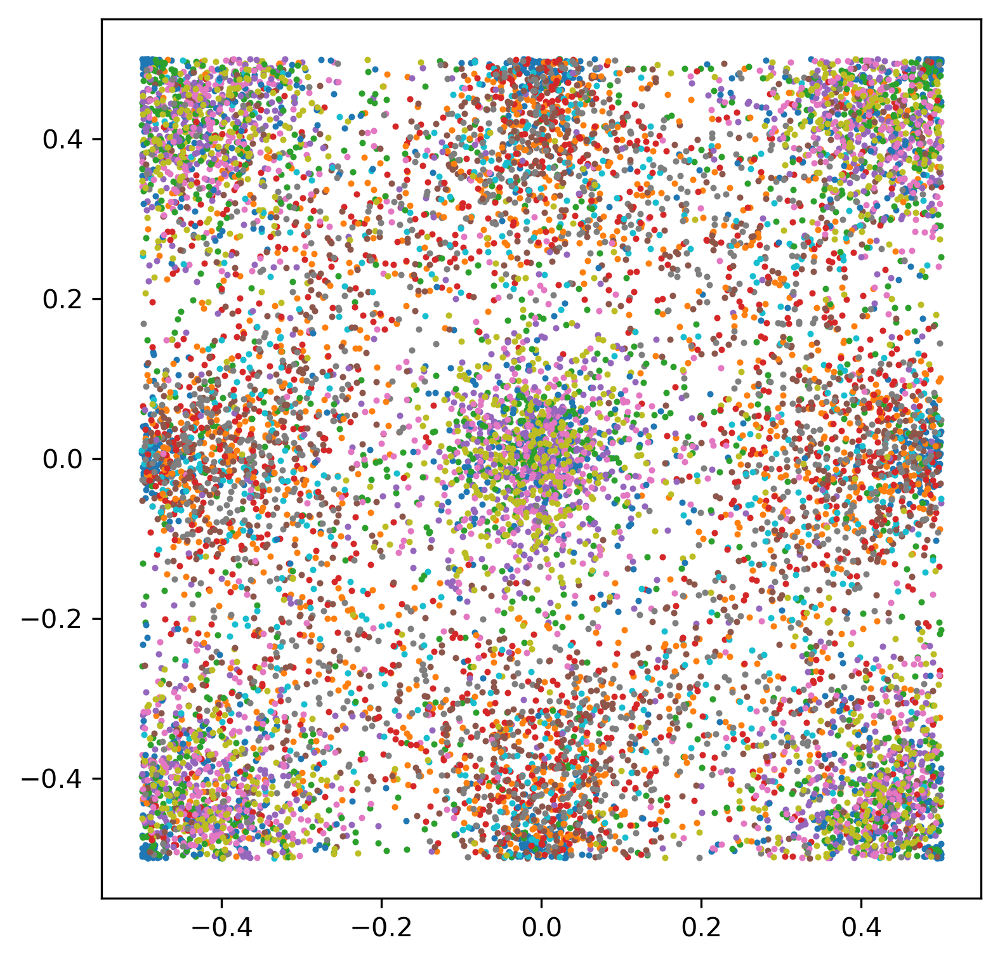

# Improved Point Sampling CICYs

This repository is a code base that generates points on Complete Intersection Calabi-Yau (CICY) manifolds using the Improved Point Sampling (IPS) method from [Keller-Lukic](https://arxiv.org/abs/0907.1387). This repository is intended to be added to the sampling code that exists for [`cymetric`](https://github.com/ruehlef/cymetric). 

In the image below, you see the current sampling ability of the `cymetric` code. In order to sample points on the CICY, this code base uses the Fubini-Study metric of the complex projective space in which the CICY lives. In the case of the Weierstrass cubic, we can visualize how well the code samples the Weierstrass in uniform Abel-Jacobi coordinates:

  

The sampling method used to create the image above was applied in to calculate the CY metric [in this paper](https://arxiv.org/abs/2205.13408). Although this sampling was used to compute the Ricci-flat CY metric, we aim to sample the CYs more effectively using the IPS method from the Keller-Lukic paper. Below, the sampling ability of the IPS implementation is shown. This code is a work in progress.

  

