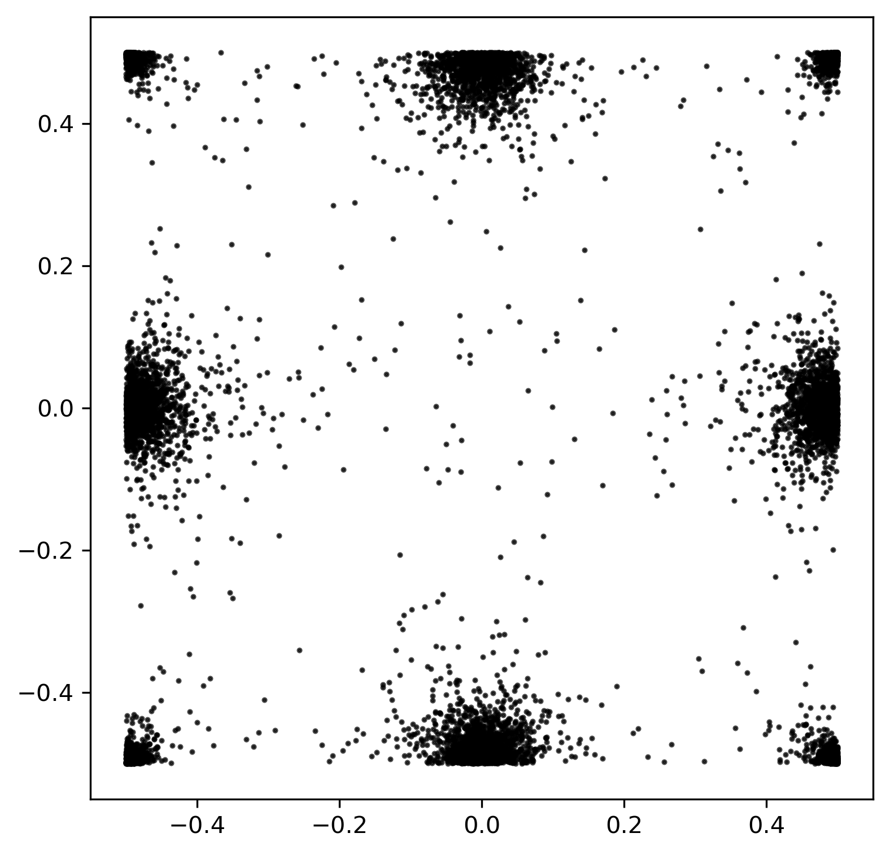
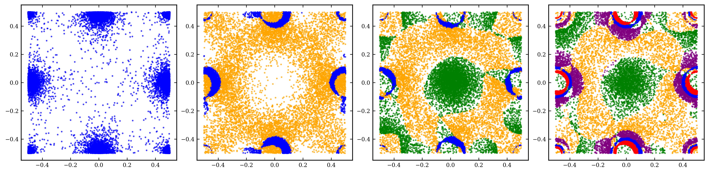

# Improved Point Sampling for CICYs

This repository is a code base that generates points on Complete Intersection Calabi-Yau (CICY) manifolds using the Improved Point Sampling (IPS) method from [Keller and Lukic 2012](https://arxiv.org/abs/0907.1387). This repository is intended to be added to the sampling code that exists for [`cymetric`](https://github.com/ruehlef/cymetric). 

In the plot below, you see the current sampling ability of `cymetric` on the Weierstrass cubic (i.e., a realization of a torus). In order to sample points on a CICY, the sampling code begins sampling with the Fubini-Study metric of the ambient space that the CICY lives in. For the Weierstrass cubic (i.e., an elliptic curve), we can visualize how well the code samples the Weierstrass in uniform Abel-Jacobi coordinates:

  

The sampling method used to create the image above was applied in to calculate the CY metric [in this paper](https://arxiv.org/abs/2205.13408). Although this sampling was used to compute the Ricci-flat CY metric, we aim to sample the CYs more effectively using the IPS method from the Keller and Lukic paper. The sampling ability of the IPS implementation is shown below:

  

Each panel shows 1, 2, 3, and 5 different optimally chosen metrics. Each color of the sampled points represents a different metric found by finding the over- or under-represented sampled patches on the CICY. This algorithm is implemented in `PointGeneratorMathematicaCICYIPS.m`.